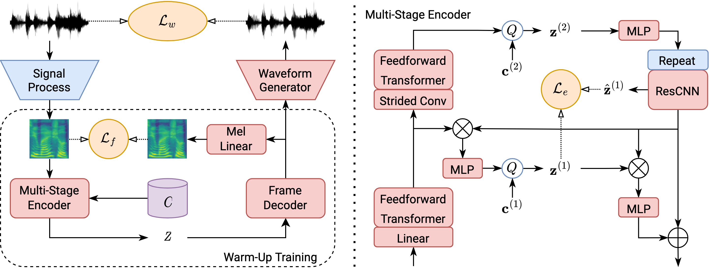

# MSMC-TTS: Multi-Stage Multi-Codebook TTS
Official Implement of MSMC-TTS System of papers 
  * [A Multi-Stage Multi-Codebook VQ-VAE Approach to High-Performance Neural TTS](https://arxiv.org/abs/2209.10887)
  * [Towards High-Quality Neural TTS for Low-Resource Languages by Learning Compact Representation](https://arxiv.org/abs/2209.10887)
  * [QS-TTS: towards semi-supervised text-to-speech synthesis via vector-quantized self-supervised speech representation learning](https://arxiv.org/pdf/2309.00126.pdf)

The latest MSMC-TTS (MSMC-TTS-v2) is optimized with a MSMC-VQ-GAN based autoencoder combining MSMC-VQ-VAE and HifiGAN. The multi-stage predictor is still applied as the acoustic model to predict MSMCRs for TTS synthesis.


## News

[2024.04.10] (In Progress) The implementation of QS-TTS is available at [examples/csmsc/configs](examples/qs-tts/configs/synthesizer/msmc_vq_gan_hubertch_aishell3.yaml)

[2022.10.20] We release the latest version of MSMC-TTS (MSMC-TTS-v2) based on MSMC-VQ-GAN. Please refer to our latest paper ["Towards High-Quality Neural TTS for Low-Resource Languages by Learning Compact Representation"](https://arxiv.org/abs/2209.10887)

[2022.10.18] We will release the code of all versions of MSMC-TTS in this repo. And anyone interested in this work is welcome to join us to explore more useful speech representations for speech synthesis. 

[2022.9.22] ["A Multi-Stage Multi-Codebook VQ-VAE Approach to High-Performance Neural TTS"](https://arxiv.org/abs/2209.10887) is published at INTERSPEECH 2022.

## Usage

```bash
# Install
pip -r requirements.txt

# Train (Take the example of CSMSC, please refer to the example of CSMSC to prepare your training data)
python train.py -c examples/csmsc/configs/msmc_vq_gan.yaml
python train.py -c examples/csmsc/configs/msmc_vq_gan_am.yaml

# Multi-GPU Training
python train_dist.py -c examples/csmsc/configs/msmc_vq_gan.yaml
python train_dist.py -c examples/csmsc/configs/msmc_vq_gan_am.yaml

# Test -- Analysis-Synthesis
python infer.py -c examples/csmsc/configs/msmc_vq_gan.yaml -m examples/csmsc/checkpoints/msmc_vq_gan/model_800000 -t examples/csmsc/data/test_ae.yaml -o analysis_synthesis

# Test -- TTS-Synthesis
python infer.py -c examples/csmsc/configs/msmc_vq_gan_am.yaml -m examples/csmsc/checkpoints/msmc_vq_gan_am/model_200000 -t examples/csmsc/data/test_tts.yaml -o tts

```

## Tips

Help you better train your models!

#### MSMC-VQ-GAN
1. Be careful for the compactness of your representation. For single-speaker standard TTS, you can try 2-4 heads, which each head may have 64 - 256 codewords.
2. Please use fewer codewords if your batch size is too small, otherwise the frame size of a batch is insufficient to support the dynamic codebook update.
3. You may change the weight of the encoder loss if you find that some stages in your MSMC-VQ-GAN learn nothing.

### Multi-Stage Predictor
1. Triplet loss can improve the expressiveness of TTS, but also may degrade the smoothness. You may try different weights of Triplet loss, such as 0, 0.01, 0.1, 1, to find the most balanced performance.
2. For low-resource datasets, please use smaller models to avoid over-fitting. Early-stop is also an useful trick.


## Citations

```latex
@inproceedings{guo2022msmc,
  title={A Multi-Stage Multi-Codebook VQ-VAE Approach to High-Performance Neural TTS},
  author={Guo, Haohan and Xie, Fenglong and Soong, Frank K and Wu, Xixin and Meng, Helen},
  booktitle={Proc. INTERSPEECH},
  year={2022}
}
```

## Acknowledge
1. FastSpeech Implementation: https://github.com/NVIDIA/NeMo
2. HifiGAN Implementation: https://github.com/jik876/hifi-gan
3. UnivNet Implementation: https://github.com/mindslab-ai/univnet
4. VITS Implementation: https://github.com/jaywalnut310/vits